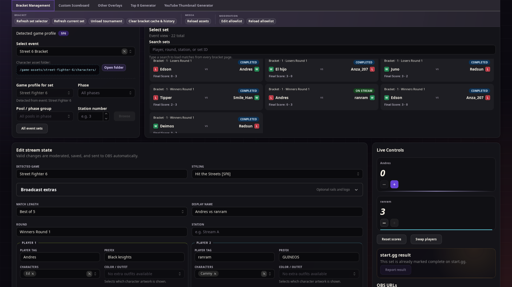
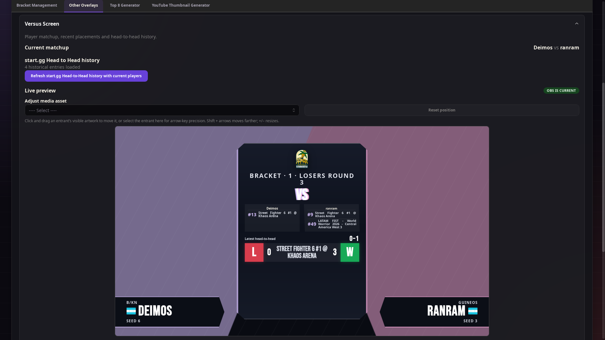
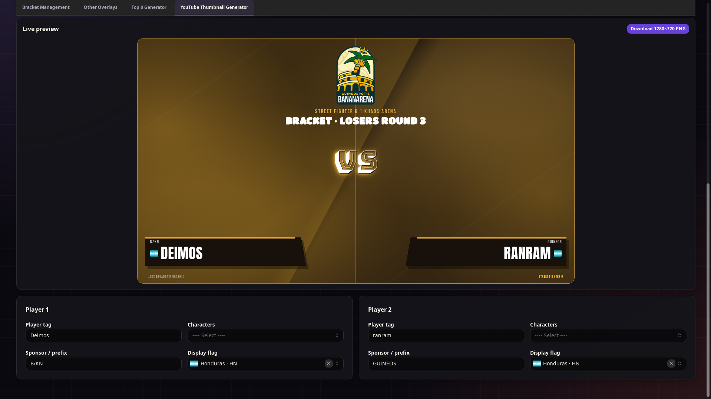
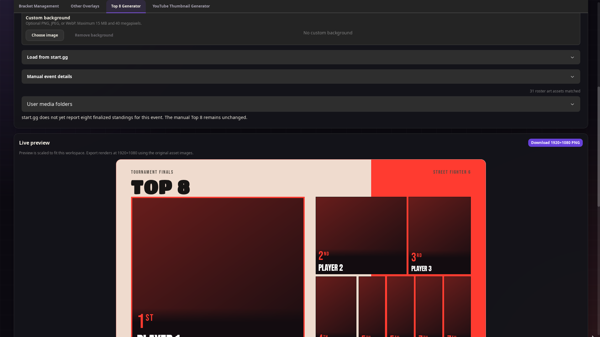

# JABS: Just Another Bracketing System

JABS is a local-first tournament and broadcast tool for the fighting game community. It loads brackets from [start.gg](https://www.start.gg/), keeps the current match ready for stream, updates scores, and sends transparent overlays to OBS.

Your token, stream settings, and local media stay on your computer. JABS sends a result to start.gg only after you review and confirm it.

## What JABS can do

- Browse events, phases, pools, stations, and sets.
- Search for a set by player, round, station, score, or set ID.
- Send a set to stream or report a quick score update.
- Update scores and player details while OBS follows the changes.
- Report a completed set to start.gg after confirmation.
- Show score, versus, Top 8 matchup, winner, champion, and commentator overlays.
- Import a custom scoreboard frame and position its live match details.
- Create downloadable Top 8 graphics and YouTube thumbnails.
- Use your own character art, player photos, sponsor logos, and tournament logos.

For a complete walkthrough, read the [User Manual](USER_MANUAL.md). The [Technical Manual](TECH_MANUAL.md) explains overlays, media folders, and customization in more detail.

## Screenshots

<table>
  <tr>
    <td width="50%"><strong>Bracket and stream controls</strong><br></td>
    <td width="50%"><strong>Versus Screen</strong><br></td>
  </tr>
  <tr>
    <td width="50%"><strong>YouTube thumbnail generator</strong><br></td>
    <td width="50%"><strong>Top 8 generator</strong><br></td>
  </tr>
</table>

## Install JABS

Download the package for your operating system from the repository's **Releases** page when a release is available.

### Windows

Run the provided `.msi` or setup `.exe` file.

### macOS

Open the `.dmg`, drag JABS into **Applications**, and launch it from there. If separate Intel and Apple Silicon builds are available, choose the one made for your Mac.

### Linux

Install the package made for your distribution, or run the AppImage:

```sh
chmod +x JABS*.AppImage
./JABS*.AppImage
```

Unsigned builds may trigger an operating-system warning. Review the release source and checksums before allowing an unsigned application to run.

## Supported games

JABS includes score-overlay styles and rules for:

- Street Fighter 6
- Tekken 8
- Avatar Legends
- MARVEL Tōkon: Fighting Souls
- Guilty Gear Strive
- 2XKO
- BlazBlue Centralfiction
- Fatal Fury: City of the Wolves
- Granblue Fantasy Versus: Rising
- The King of Fighters XV
- Melty Blood: Type Lumina
- Mortal Kombat 1
- Ultimate Marvel vs. Capcom 3
- Super Smash Bros. Ultimate
- Under Night In-Birth II Sys:Celes

You can still load events for other games. If JABS does not recognize a game's rules, it will ask you to choose a rules profile. Local character media uses the game's own asset folder.

## Connect to start.gg

JABS needs a start.gg API token to load tournament information.

1. Follow the official [start.gg authentication instructions](https://developer.start.gg/docs/authentication/).
2. Sign in and open **Developer Settings**.
3. Create a token named `JABS`.
4. Copy it immediately and store it somewhere private. start.gg shows a new token only once.
5. Open **API access** in JABS and paste the token.

Choose **Save token** to use your operating system's secure credential storage. Choose **Use for session** to keep it only in memory until JABS closes. If secure storage is unavailable, use the session option; JABS will not fall back to plain-text storage.

Treat the token like a password. No one working on JABS, running a tournament, or providing support needs to see it. Never put it in a GitHub issue, message, screenshot, URL, log, source file, or committed `.env` file. If it is exposed, revoke it on start.gg and create a new one.

## Load and run a set

1. Enter a tournament slug or paste an official start.gg tournament URL.
2. Choose an event.
3. Narrow the list by phase, pool, or station if needed.
4. Search for a set and open it.
5. Choose **Send to Stream**.
6. Check the imported players, round, game, and score.
7. Update the score as games finish.

Changes that pass validation appear in OBS automatically. JABS asks for confirmation before reporting a completed result to start.gg and never reports one on its own.

## Add JABS to OBS

Keep JABS open while its overlays are in use. Add each overlay as an OBS **Browser Source** with a width of `1920` and height of `1080`.

| Overlay | URL |
|---|---|
| Active score | `http://127.0.0.1:4279/overlay/active/main` |
| Winner | `http://127.0.0.1:4279/overlay/active/winner` |
| Champion | `http://127.0.0.1:4279/overlay/active/champion` |
| Versus | `http://127.0.0.1:4279/overlay/active/versus` |
| Top 8 Matchups | `http://127.0.0.1:4279/overlay/active/top-eight-matchups` |
| Commentators | `http://127.0.0.1:4279/overlay/commentators` |

The active routes follow the match and styling selected in JABS. A fixed game style is also available at:

```txt
http://127.0.0.1:4279/overlay/<game-id>/main
```

If OBS opened a source before JABS started, open the Browser Source properties and choose **Refresh cache of current page**.

JABS uses port `4279` by default. To choose another local port, set `JABS_PORT` in `.env` and update every OBS URL to match:

```env
JABS_PORT=4280
```

The local service remains restricted to `127.0.0.1`; changing the port does not make it available over the local network.

## Add your own media

JABS matches local files by their filenames. PNG, JPEG, and WebP are supported.

| Media | Folder | How it matches |
|---|---|---|
| Character art | `game-assets/<game-slug>/characters/` | Character name |
| Character portrait | `game-assets/<game-slug>/portraits/` | Character name |
| Player photo | `players/` | Player tag |
| Sponsor logo | `sponsors/` | Sponsor or prefix |
| Tournament logo | `tourney-logos/` | Chosen from JABS |

The README inside each folder explains its filename rules. Only use media you have permission to display or redistribute.

Character colors and outfits can share one character entry by adding numbers to their filenames, such as `Mario-1.png` and `Mario-2.png`. See [Game artwork](game-assets/README.md) for the full naming guide. Use **Reload assets** after adding or replacing local media; JABS does not need to restart.

## Languages

The interface includes English and Latin American Spanish. Both translations are bundled with the app and work offline.

## Privacy and security

- The local service listens only on `127.0.0.1`.
- Tokens never appear in OBS pages, URLs, logs, or the JABS SQLite database.
- Saved tokens use the operating system's credential storage.
- Local media is served through restricted catalogs, not arbitrary file paths.
- Text is validated before it reaches a stream or exported graphic.
- Reporting a result always requires confirmation.

Read [SECURITY.md](SECURITY.md) for the security policy and instructions for reporting a vulnerability.

## Build from source

You will need:

- Node.js `24.15.0` or newer
- pnpm `11.18.0`
- Rust `1.97.1` or newer with Cargo
- The [Tauri 2 prerequisites](https://v2.tauri.app/start/prerequisites/) for your operating system
- WebKitGTK `2.52.3` or newer on Linux

Install the locked dependencies and start JABS:

```sh
pnpm install --frozen-lockfile
pnpm run dev
```

Check a change with:

```sh
pnpm check
pnpm run build
```

Rust build files can become large. Remove them without deleting source code or saved JABS data:

```sh
pnpm run clean:native
```

## License

Original JABS code and documentation are available under the [Apache License 2.0](LICENSE). Third-party libraries, data, and fonts keep their own licenses; see [THIRD_PARTY_NOTICES.md](THIRD_PARTY_NOTICES.md).

User-provided and third-party artwork is not covered by the JABS license. Read [ASSET_LICENSES.md](ASSET_LICENSES.md) before sharing media with the source code or an installer.

## Support

Support JABS development through [Ko-fi](https://ko-fi.com/ranram).
